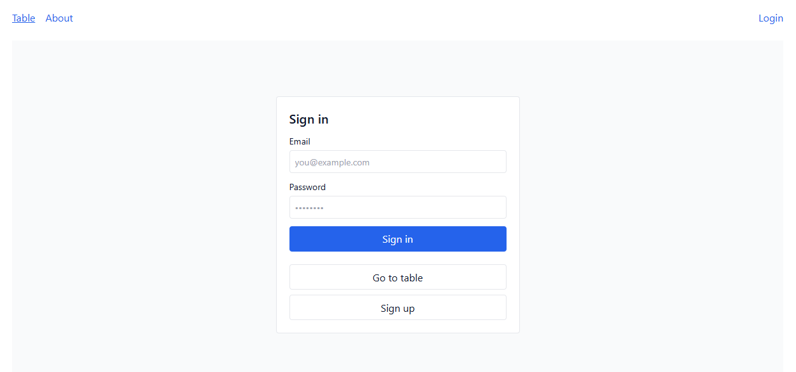
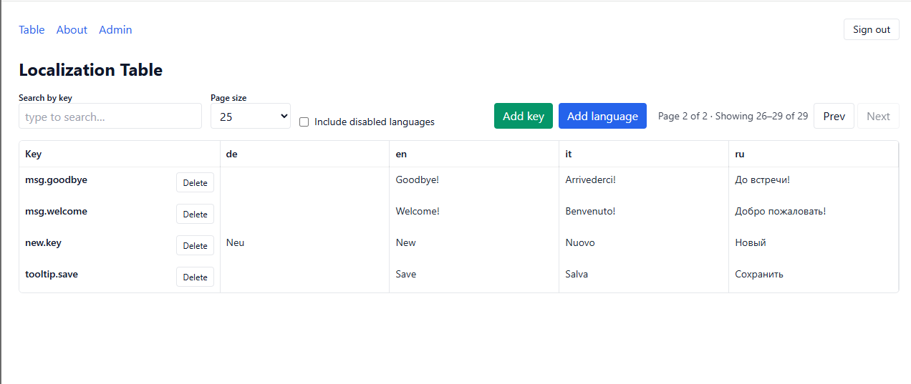

# 🎮 Game Localization Platform

A localization management tool for games.  
It helps teams manage translation keys and their values across multiple languages,  
with authentication, project management, and an admin panel.

Stack: .NET 8 (Web API) + PostgreSQL + React (Vite + Tailwind), fully dockerized.

---

## ✨ Features

- User authentication (login and registration)
- Manage projects, languages, keys, and translations
- Table view of all keys with per-language translations
- Inline editing of translations with autosave
- Add new keys, enable or disable languages
- Admin panel for managing languages (create, edit, delete)
- API versioning with Swagger UI
- Layered architecture (Core · Infrastructure · API · Tests)
- Docker Compose setup (backend + frontend + database)

---

## 🛠 Tech Stack

**Backend**

- ASP.NET Core 8 (Web API)
- EF Core + PostgreSQL
- FluentValidation, FluentResults
- AutoMapper (ApiDTO ↔︎ DTO ↔︎ Domain)
- API Versioning (Asp.Versioning)
- Swagger / OpenAPI

**Frontend**

- React + Vite
- TailwindCSS
- Axios (withCredentials)
- Nginx (serving production build)

---

## 🚀 Quick Start

### 1) Clone repository

```bash
git clone https://github.com/novitski17/game-localization
cd game-localization
```

### 2) Environment setup

This project uses **two `.env` files**:

- `.env` in project root → backend & database configuration
- `game-localization-frontend/.env` → frontend configuration (e.g. `VITE_API_BASE_URL`)

Copy example files and adjust values if needed (DB credentials, secrets, API URL):

```bash
cp .env.example .env
cp game-localization-frontend/.env.example game-localization-frontend/.env
```

### 3) Run with Docker

```bash
docker compose up --build -d
```

### 4) Access services

- Frontend → [http://localhost:3000](http://localhost:3000)
- Backend API → [http://localhost:8080/api/v1.0](http://localhost:8080/api/v1.0)
- Swagger → [http://localhost:8080/swagger](http://localhost:8080/swagger)

---

📸 Screenshots





## 📂 Structure

```
backend/
  GameLocalization.Api/            # Web API layer
  GameLocalization.Core/           # Domain layer (entities, services, validation, results)
  GameLocalization.Infrastructure/ # Data access (EF Core, PostgreSQL)
  GameLocalization.Tests/          # Unit and integration tests
game-localization-frontend/        # React + Vite + Tailwind (served by Nginx)
docker-compose.yml
```
